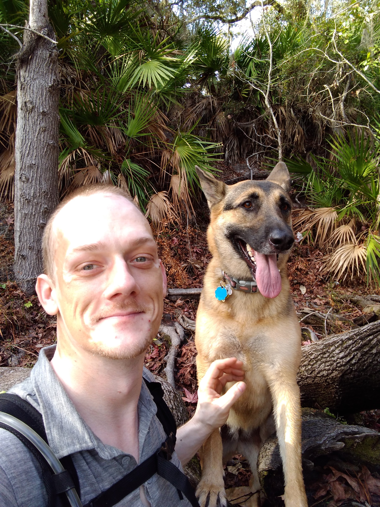

Hi!

I've been traveling since 2017. Athena joined me after leaving a shelter on May 25'th 2018 from Ponca City Oklahoma. We have been nomadic off and on for most of that time. First living my a van, and now a shuttle bus. As situation allow we travel as much as possible. 

This page was created because very often I'm asked about how I find events, and if there is a central list somewhere of events where nomads and aspiring nomads can meetup. I started my time in the vanlife community, and was adopted into the skoolie life as I looked for something similar for my shuttle bus. In between I've also hung out with a group of vegabonds for a bit. All of these groups have one thing in common. We like to be social, without giving up our freedom to roam. 

This site is my first stab at gathering a collection of all events in one place. The only rules are that the groups don't discriminate who may join them. For example no "RV's must be under 10 years old" nonesense. 

If you enjoy this content, would like to add an event or have any comments please reach out to me on Instagram. @daficco 